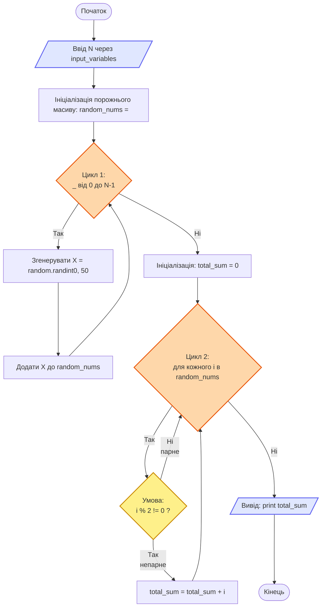

```mermaid
graph TD
    Start([Початок]) --> Input[/Ввід N через input_variables/]
    Input --> InitArr[Ініціалізація порожнього масиву: random_nums = &nbsp;&nbsp;]
    InitArr --> Loop1{Цикл 1:<br>_ від 0 до N-1}
    
    Loop1 -- Так --> GenRand[Згенерувати X = random.randint0, 50]
    GenRand --> Append[Додати X до random_nums]
    Append --> Loop1
    
    Loop1 -- Ні --> InitSum[Ініціалізація: total_sum = 0]
    InitSum --> Loop2{Цикл 2:<br>для кожного i в random_nums}
    
    Loop2 -- Так --> Cond{Умова:<br>i % 2 != 0 ?}
    Cond -- Так <br>непарне --> AddSum[total_sum = total_sum + i]
    Cond -- Ні <br>парне --> Loop2
    AddSum --> Loop2
    
    Loop2 -- Ні --> Output[/Вивід: print total_sum/]
    Output --> End([Кінець])
    
    classDef io fill:#e0e7ff,stroke:#6366f1,stroke-width:2px;
    classDef cond fill:#fef08a,stroke:#ca8a04,stroke-width:2px;
    classDef loop fill:#fed7aa,stroke:#ea580c,stroke-width:2px;
    class Input,Output io;
    class Cond cond;
    class Loop1,Loop2 loop;
```