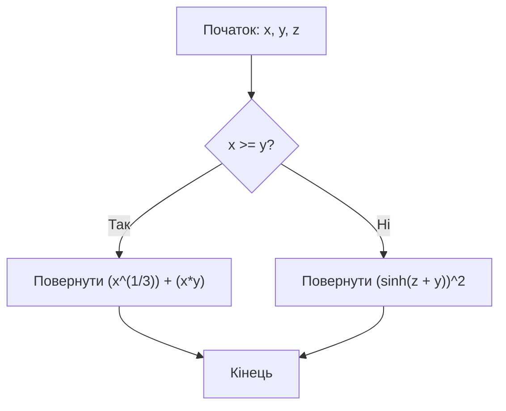
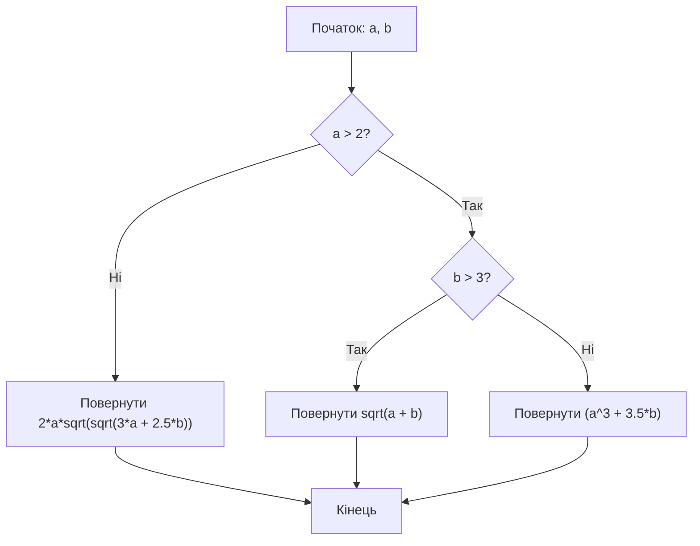

# Лабораторна робота №1

## Навчальний заклад

Відокремлений структурний підрозділ
**"Фаховий коледж інформаційних технологій**
**Національного університету “Львівська політехніка”**

**Виконав:** студент групи МТ-22
**Одарчук Олексій**

---

## Тема

>Робота у середовищі програмування Python. Розроблення алгоритмів з розгалуженням та їх реалізація у вигляді програм

## Мета

>Навчитись розробляти розгалужені алгоритми та програми їх реалізації, виконувати налагодження програм.

## Завдання

>Складіть блок-схему, розробіть код розгалуженого алгоритму та реалізуйте його, використавши вхідні дані (дані ввести з клавіатури). Виведіть результат з двома цифрами після коми:



>Складіть блок-схему, розробіть код обчислення значення y (величини a і b –
довільні дійсні числа, що вводяться з клавіатури). Виведіть результат з трьома
цифрами після коми:



## Відповіді на контрольні запитання

1. **Які існують види розгалужень?**  
    Повні, неповні, багатоваріантне, вкладене, тернарне
2. **Яку структуру має команда неповного розгалуження мовою Python?**  

    ```python
    if (conduction):
        body
    ```

3. **Яку структуру має команда повного розгалуження мовою Python?**  

    ```python
    if (conduction):
        body
    else:
        body
    ```

4. **Які розгалуження називають вкладеними**  
    Таке, що знаходиться всередині іншого розгалуження

5. **Як вкладене розгалуження реалізується у мові Python?**

   ```python
    if (conduction):
        if (conduction):
            if (conduction):
                body
    else:
        body
   ```
