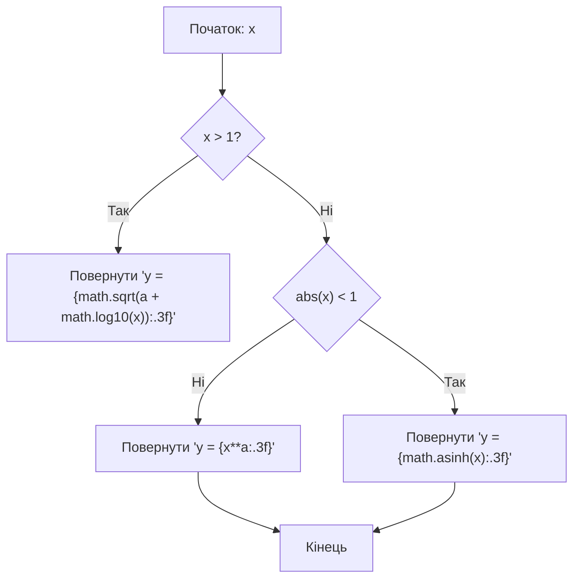
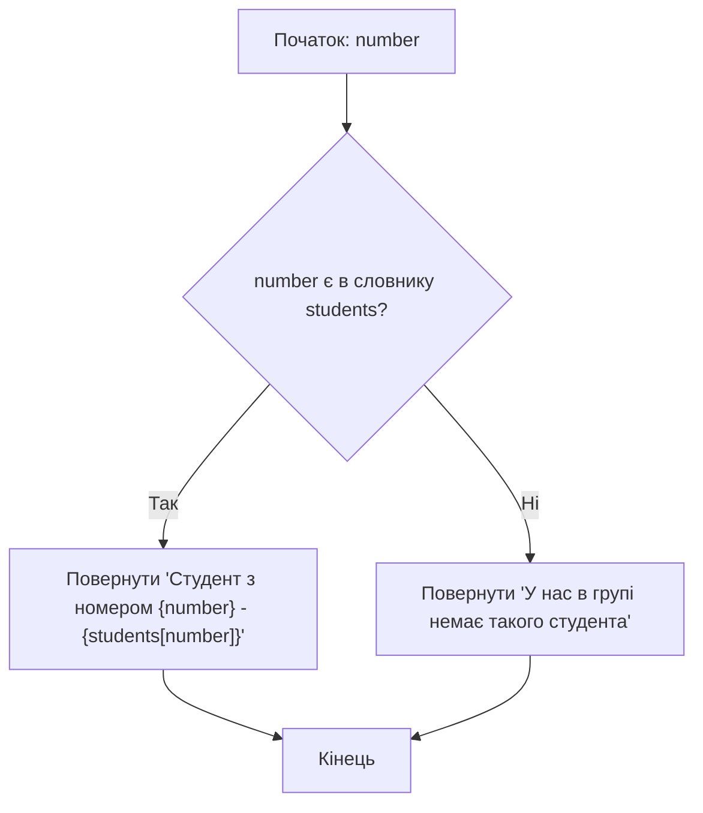

# Лабораторна робота №2

## Навчальний заклад

Відокремлений структурний підрозділ
**"Фаховий коледж інформаційних технологій**
**Національного університету “Львівська політехніка”**

**Виконав:** студент групи МТ-22
**Одарчук Олексій**

---

## Тема

>Алгоритми з розгалуженням мови Python. Команда вибору

## Мета

> Навчитись розробляти розгалужені алгоритми та програми їх реалізації, виконувати налагодження програм.

## Завдання

>Скласти блок-схему та програму для обчислення значення заданої функції y(x) з використанням повної форми розгалуження за введеним з клавіатури значенням змінної x:

>В журналі академічної групи виберіть навмання вісім студентів (Прізвище Ім’я). Розробіть код, за допомогою якого за номером студентів і студенток повідомляється їх прізвище та ім’я.

## Відповіді на контрольні запитання

1. **Для чого в програмах застосовують команду розгалуження?**
    Команди розгалуження дозволяють програмі приймати рішення залежно від певних умов. Завдяки цьому програма може виконувати різні дії в залежності від значень змінних або результатів обчислень.

2. **Опишіть процес виконання команди повного розгалуження if-else.**
    - Спочатку перевіряється умова після `if`.
    - Якщо умова істинна (`True`), виконується блок коду під `if`.
    - Якщо умова хибна (`False`), виконується блок коду під `else`.

    Таким чином гарантовано, що виконається *один з двох блоків коду*.

3. **Як виконується команда короткого розгалуження if?**
    - Перевіряється умова після `if`.
    - Якщо умова істинна (`True`), виконується блок коду під `if`.
    - Якщо умова хибна (`False`), нічого не виконується (блоку `else` немає).

4. **В чому проявляються відмінності між короткою та повною формами розгалуження?**

    | Коротка форма (`if`)                  | Повна форма (`if-else`)                       |
    |:------------------------------------- | ---------------------------------------------:|
    | Виконує код тільки при істинній умові | Виконує код при істинній **або хибній** умові |
    | Не має блоку `else`                   | Має блок `else`                               |
    | Проста для перевірки однієї умови     | Дає можливість обробляти обидва випадки       |

5. **Яку структуру має команда вибору мовою Python?**

    - `if` умова:  
    Блок коду, який виконується, якщо умова істинна
    - `elif` умова: (необов’язково)  
    Додаткові умови для перевірки
    - `else`: (необов’язково)  
    Блок коду, який виконується, якщо жодна з умов не істинна

6. **Які розділові знаки та синтаксичні особливості використовуються при написанні команд розгалуження в Python?**
    - Двокрапка `:` в кінці рядка з `if`, `elif` або `else`
    - Відступи (звичайно 4 пробіли, або tab) для блоків коду
    - В Python немає фігурних дужок `{}` для позначення блоків коду (C-style)
    - Умови записуються без круглих дужок, хоча їх можна використовувати для читабельності
