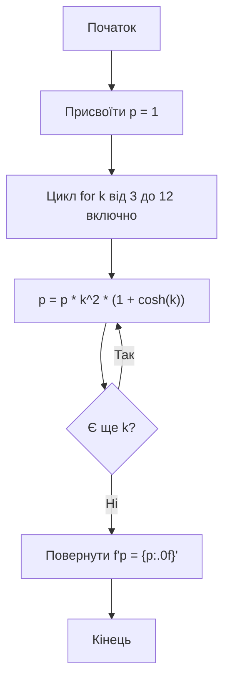

# Лабораторна робота №3

## Навчальний заклад

Відокремлений структурний підрозділ
**"Фаховий коледж інформаційних технологій**
**Національного університету “Львівська політехніка”**

**Виконав:** студент групи МТ-22
**Одарчук Олексій**

---

## Тема

>Алгоритми з повторенням мови Python. Цикл з параметром

## Мета

>Навчитись розробляти циклічні алгоритми та програми їх реалізації виконувати налагодження програм

## Завдання

>Скласти блок-схему та програму на мові програмування Python. При виконанні даного завдання обчислити вираз з використанням оператора циклу `for`



>У заданій послідовності комп’ютерних термінів підрахувати кількість конкретного терміна ('біт') й вивести його стільки разів, скільки він повторюється.

## Відповіді на контрольні запитання

1. **Які алгоритми називають алгоритмами з повторенням?**

    Алгоритми з повторенням — це алгоритми, у яких **один або кілька кроків виконуються багато разів** до настання певної умови. Такі алгоритми використовують **цикли** (`for`, `while`) для багаторазового виконання одного блоку коду.

2. **Поясніть сутність виконання команди повторення з оператором for**

    - Оператор for дозволяє виконувати блок коду певну кількість разів.
    - Він перебирає значення із заданого діапазону або послідовності.
    - На кожному кроці циклу змінна циклу отримує нове значення, і виконується тіло циклу.
    - Після завершення всіх значень цикл закінчується і виконання програми продовжується далі.

3. **Наведіть приклад команди повторення з оператором for і функцією range()**

    ```python
    for i in range(1, 6):
        print(f"Крок циклу: {i}")
    ```

    Пояснення:
    - range(1, 6) створює послідовність чисел від 1 до 5 включно.  
    - Цикл for перебирає ці числа, присвоює їх змінній i і виконує блок print() для кожного значення.
