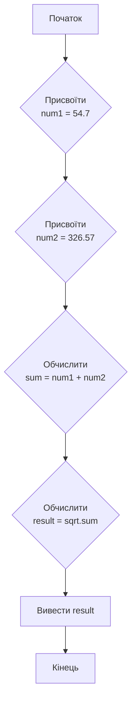
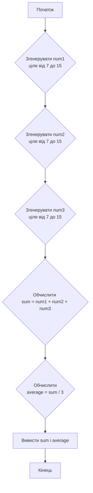

# Практична робота №1

## Навчальний заклад

Відокремлений структурний підрозділ
**"Фаховий коледж інформаційних технологій**
**Національного університету “Львівська політехніка”**

**Виконав:** студент групи МТ-22
**Одарчук Олексій**

---

## Тема

>Робота у середовищі програмування Python. Розроблення лінійних алгоритмів та їх реалізація у вигляді програм

## Мета

Навчитись виконанню в інтерактивному режимі середовища IDLE найпростіших
команд і кодів в режимі виконання файлів програмного коду; навчитись розробляти лінійні
алгоритми та програми їх реалізації, виконувати налагодження програм.

## Завдання 2.6: Блок-схеми

### Блок-схема до завдання 2.2

**Завдання:** Розробити код обчислення кореня квадратного із суми чисел 54,7 і 326,57.



### Блок-схема до завдання 2.5

**Завдання:** Розробити код обчислення суми трьох випадкових чисел у діапазоні від 7 до 15 і визначення їх середнього значення.



---

## Контрольні запитання та відповіді

**1. Поясніть сутність динамічної типізації даних.**

- **Відповідь:** Тип змінної визначається автоматично в момент присвоєння їй значення. Тобто не треба явно оголошувати тип данних, як в С++. Одна і та сама змінна може по черзі зберігати дані різних типів.

    ```python
    # a - це число
    a = 10
    print(type(a))  # <class 'int'>

    # a - це рядок
    a = "рядок"
    print(type(a))  # <class 'str'>
    ```

**2. Наведіть приклади ділення чисел без остачі та факторіалу числа.**

- **Відповідь:**
  - **Ділення без остачі:**

    ```python
    result = 10 // 3
    print(result)  # Виведе: 3
    ```

  - **Факторіал числа:**

    ```python
    import math

    result = math.factorial(5)
    print(result)  # Виведе: 120
    ```

**3. Поясніть порядок виконання оператора присвоювання.**

- **Відповідь:** Спочатку обчислюється вираз праворуч від знака `=`, а потім результат присвоюється змінній ліворуч.

    ```python
    x = 5 + 10  # Спочатку обчислюється 5 + 10 (результат 15),
                # потім значення 15 присвоюється змінній x.
    ```

**4. Які складові містять арифметичні вирази?**

- **Відповідь:** Операнди і оператори.

**5. Як виконується оператор input?**

- **Відповідь:** ****ФУНКЦІЯ**** `input()` читає рядок, введений користувачем з клавіатури, і завжди повертає його у вигляді рядка (`str`). Якщо потрібне число, результат `input()` необхідно явно перетворити на числовий тип.

    ```python
    age_str = input("Введіть ваш вік: ")
    age_int = int(age_str)
    print(f"Наступного року вам буде {age_int + 1}")
    ```

**6. Які основні функції містить модуль math?**

- **Відповідь:** Модуль `math` доступ до стандартних математичних функцій. Самі популярні:
  - `math.sqrt(x)`: квадратний корінь з `x`.
  - `math.pow(x, y)`: `x` у степені `y`.
  - `math.sin(x)`, `math.cos(x)`, `math.tan(x)`: тригонометричні функції.
  - `math.log(x, base)`: логарифм `x` за основою `base`.
  - `math.ceil(x)`: заокруглення до найближчого більшого цілого.
  - `math.floor(x)`: заокруглення до найближчого меншого цілого.
  - Константи: `math.pi`, `math.e`.

**7. Які основні функції містить модуль random?**

- **Відповідь:** Модуль `random` використовується для генерації псевдовипадкових чисел. Основні функції:
  - `random.randint(a, b)`: повертає випадкове ціле число N, де `a <= N <= b`.
  - `random.random()`: повертає випадкове число з плаваючою комою в діапазоні `[0.0, 1.0)`.
  - `random.uniform(a, b)`: повертає випадкове число з плаваючою комою N, де `a <= N <= b`.
  - `random.choice(sequence)`: повертає випадковий елемент з послідовності.

---
