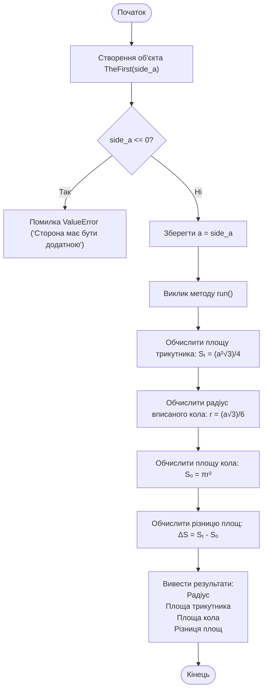
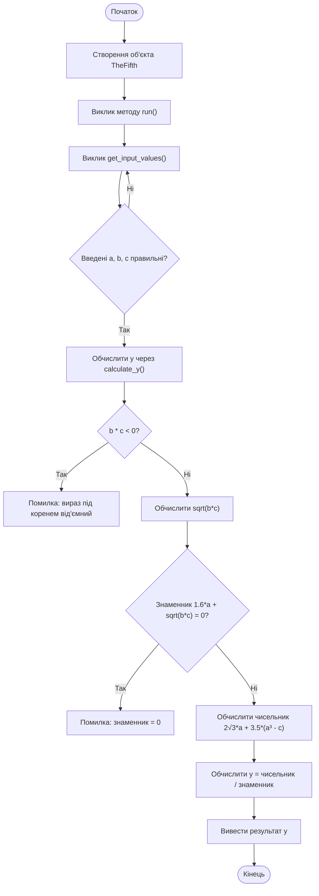

# Практична робота №2

## Навчальний заклад

Відокремлений структурний підрозділ
**"Фаховий коледж інформаційних технологій**
**Національного університету “Львівська політехніка”**

**Виконав:** студент групи МТ-22
**Одарчук Олексій**

---

## Тема

>Робота у середовищі програмування Python. Розробка лінійних алгоритмів та їх реалізація у вигляді програм з використанням текстових файлів

## Мета

Навчитись виконанню в інтерактивному режимі середовища IDLE найпростіших команд і кодів в режимі виконання файлів програмного коду; навчитись розробляти лінійні алгоритми та програми їх реалізації, виконувати налагодження програм.

## Завдання 6: Блок-схеми

### Блок-схема до завдання 1

**Завдання:** Розробіть код обчислення площі рівностороннього трикутника зі стороною a, площі вписаного у трикутник кола і їх різниці. Виконайте код для різних значень сторони трикутника.



### Блок-схема до завдання 5

**Завдання:** Розробіть код обчислення значення виразу за умови, що значення змінних a, b, c вводяться з клавіатури



---

## Контрольні запитання та відповіді

## 1. Що називається списком?

Список - це структура даних в Python, яка дозволяє зберігати впорядковану колекцію елементів. Списки створюються за допомогою квадратних дужок.

Приклад:

```python
my_list = [1, 2, 3, 4, 5]
names = ["Іван", "Марія", "Петро"]
```

Списки можуть містити елементи різних типів (числа, рядки, інші списки) і є змінюваними, тобто можна додавати, видаляти та змінювати елементи після створення списку.

---

## 2. Для чого слугують методи append(); remove()?

**append()** - додає елемент в кінець списку.

Приклад:

```python
fruits = ["яблуко", "банан"]
fruits.append("апельсин")
# ['яблуко', 'банан', 'апельсин']
```

**remove()** - видаляє перше входження вказаного елемента зі списку.

Приклад:

```python
fruits = ["яблуко", "банан", "апельсин"]
fruits.remove("банан")
# ['яблуко', 'апельсин']
```

Якщо елемента немає у списку, метод remove() викличе помилку ValueError.

---

## 3. Поясніть сутність методу insert()

Метод insert() вставляє елемент на вказану позицію в списку. Він приймає два аргументи: індекс позиції та сам елемент.

Синтаксис:

```python
список.insert(індекс, елемент)
```

Приклад:

```python
numbers = [1, 2, 4, 5]
numbers.insert(2, 3)  # Вставляємо 3 на позицію з індексом 2
# [1, 2, 3, 4, 5]
```

Всі елементи після вказаного індексу зсуваються вправо. Якщо індекс більший за довжину списку, елемент додається в кінець.

---

## 4. Поясніть порядок створення списку випадкових чисел

Для створення списку випадкових чисел потрібно використати модуль random.

Порядок дій:

1. Імпортувати модуль random
2. Створити порожній список
3. За допомогою циклу згенерувати потрібну кількість випадкових чисел
4. Додати кожне число до списку

Приклад:

```python
import random

random_numbers = []
for i in range(10):
    random_numbers.append(random.randint(1, 100))

print(random_numbers)
```

Альтернативний спосіб через генератор списків:

```python
import random

random_numbers = [random.randint(1, 100) for _ in range(10)]
```

Функція random.randint(a, b) генерує випадкове ціле число від a до b включно.

---

## 5. Як оголошуються словники?

Словники в Python оголошуються за допомогою фігурних дужок {} або функції dict(). Словник складається з пар "ключ: значення".

```python
student = {
    "ім'я": "Володя",
    "вік": 16,
    "курс": 2
}
```

Ключі у словнику мають бути унікальними та незмінюваними (числа, рядки, кортежі). Значення можуть бути будь-якого типу.

---

## 6. Як можна перевірити наявність ключа у словнику?

Є кілька способів перевірити наявність ключа у словнику:

**Спосіб 1 - оператор in (найпоширеніший):**

```python
student = {"ім'я": "Іван", "вік": 20}

if "ім'я" in student:
    print("Ключ існує")
```

**Спосіб 2 - метод get():**

```python
value = student.get("ім'я")  # Поверне значення або None
if value is not None:
    print("Ключ існує")
```

**Спосіб 3 - метод keys():**

```python
if "ім'я" in student.keys():
    print("Ключ існує")
```

Перший спосіб є найзручнішим та найчастіше використовується на практиці.

---

## 7. Як можна видалити елемент зі словника?

Існує декілька способів видалення елементів зі словника:

**Спосіб 1 - оператор del:**

```python
student = {"ім'я": "Іван", "вік": 20, "курс": 2}
del student["вік"]
# {'ім'я': 'Іван', 'курс': 2}
```

**Спосіб 2 - метод pop():**

```python
student = {"ім'я": "Іван", "вік": 20}
age = student.pop("вік")  # Видаляє і повертає значення
# age = 20
# student = {'ім'я': 'Іван'}
```

**Спосіб 3 - метод popitem():**

```python
student.popitem()  # Видаляє останню пару ключ-значення
```

**Спосіб 4 - метод clear():**

```python
student.clear()  # Очищує весь словник
```

Якщо ключа не існує, del викличе помилку KeyError, тому краще використовувати pop() з значенням за замовчуванням.

---

## 8. Яку функцію виконує метод keys()?

Метод keys() повертає об'єкт, який містить усі ключі словника. Цей об'єкт можна використовувати для ітерації або перетворити в список.

Приклад:

```python
student = {"ім'я": "Володя", "вік": 16, "курс": 2}

keys = student.keys()
print(keys)  # dict_keys(['ім'я', 'вік', 'курс'])

# Перетворення в список
keys_list = list(student.keys())
print(keys_list)  # ['ім'я', 'вік', 'курс']

# Використання в циклі
for key in student.keys():
    print(key, ":", student[key])
```

Метод keys() корисний, коли потрібно отримати всі ключі словника для подальшої обробки або перевірки.

---

## 9. Для чого призначений метод update()?

Метод update() використовується для оновлення словника. Він додає нові пари ключ-значення або змінює існуючі значення.

Приклад 1 - оновлення з іншого словника:

```python
student = {"ім'я": "Володя", "вік": 16}
new_data = {"вік": 17, "курс": }

student.update(new_data)
# Результат: {'ім'я': 'Володя', 'вік': 17, 'курс': 2}
```

Приклад 2 - оновлення через ключові аргументи:

```python
student.update(email="shawyhaf@gmail.com")
# Додасть новий ключ email
```

Метод update() зручний для об'єднання словників або масового оновлення даних. Якщо ключ вже існує - значення перезаписується, якщо ні - додається нова пара.

---

## 10. Поясніть сутність методу values()

Метод values() повертає об'єкт, який містить усі значення словника (без ключів). Цей об'єкт можна використовувати для ітерації або перетворення в список.

Приклад:

```python
student = {"ім'я": "Вова", "вік": 16, "курс": 2}

values = student.values()
print(values)  # dict_values(['Вова', 16, 2])

# Перетворення в список
values_list = list(student.values())
print(values_list)  # ['Вова', 16, 2]

# Використання в циклі
for value in student.values():
    print(value)
```

Метод values() корисний, коли потрібно обробити всі значення словника, не звертаючи уваги на ключі. Наприклад, для підрахунку суми всіх числових значень або пошуку конкретного значення.

---
