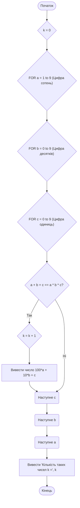
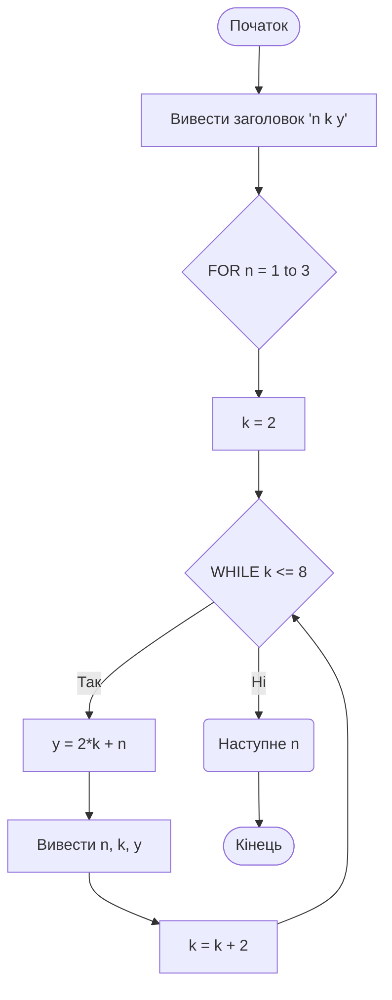
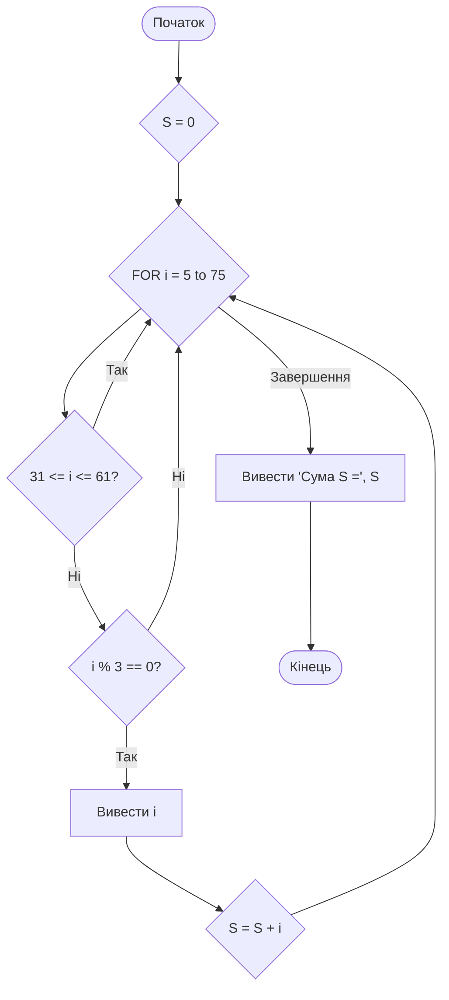
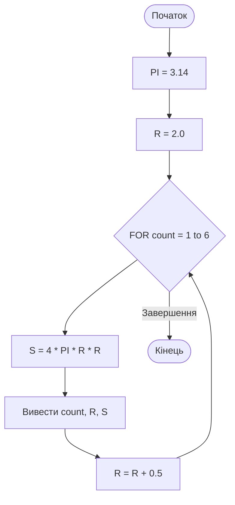

# Практична робота №3

## Навчальний заклад

Відокремлений структурний підрозділ
**"Фаховий коледж інформаційних технологій**
**Національного університету “Львівська політехніка”**

**Виконав:** студент групи МТ-22
**Одарчук Олексій**

---

## Тема

> Алгоритми з повторенням мови Python. Вкладені цикли

## Мета

Навчитись розробляти циклічні алгоритми та програми їх реалізації, виконувати налагодження програм.

### Завдання 1

#### Приклад 2

#### Приклад 3

### Завдання 2

### Завдання 3

---

## Контрольні запитання та відповіді

1. **Які завдання в програмах вирішують циклічні алгоритмічні конструкції?**  
    Циклічні алгоритмічні конструкції використовуються для **багаторазового повторення** однакового блоку коду доти, доки не буде виконана певна умова, або для **обробки всіх елементів** у колекції даних (списку, рядку тощо).
    
2. **Які оператори циклу реалізовано в мові програмування Python?**  
    У Python реалізовано два основні оператори циклу:

    `while`: Цикл з **передумовою**. Виконується, **доки умова істинна** (кількість ітерацій заздалегідь невідома).

    `for`: Цикл **для ітерації**. Перебирає **кожний елемент** у заданій послідовності (наприклад, `for item in my_list:`).

3. **Які розділові знаки та синтаксичні особливості використовуються при написанні команд циклів у Python?**  
    Ключові синтаксичні особливості:

    - **Двокрапка** (`:`): Обов'язково ставиться в кінці рядка команди циклу (`while умова:** `або `for елемент in послідовність:`**).

    - **Відступи (Indentation)**: Тіло циклу (команди, що повторюються) **обов'язково** виділяється **однаковим відступом** (зазвичай 4 пробіли). Це єдина ознака належності команд до циклу.

    - Керуючі оператори:

        - `break`: Негайно **припиняє** виконання циклу.

        - `continue`: Переходить до **наступної ітерації**, пропускаючи решту команд у поточній.